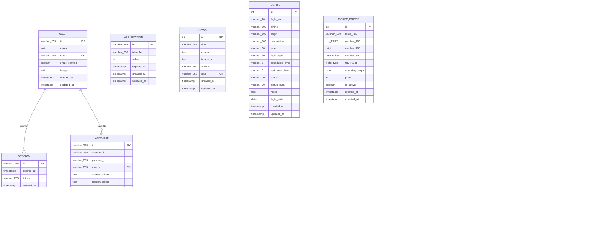
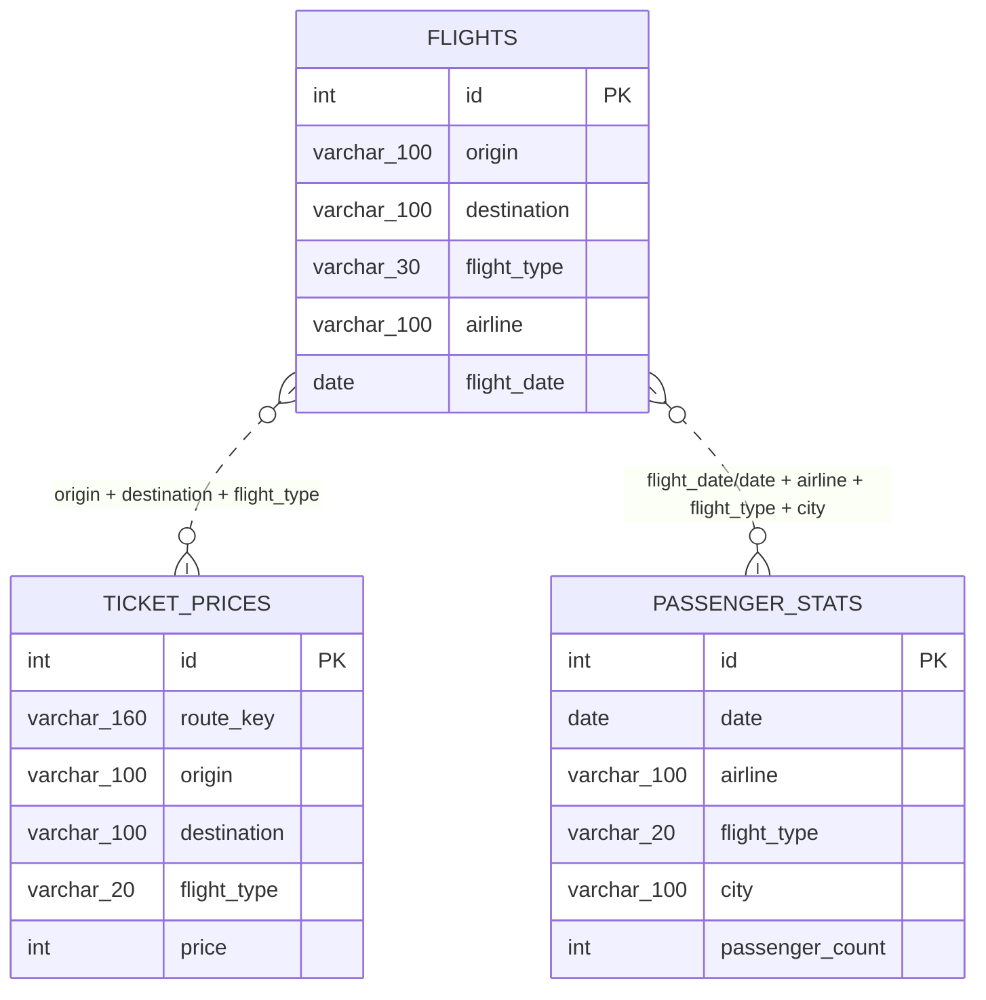
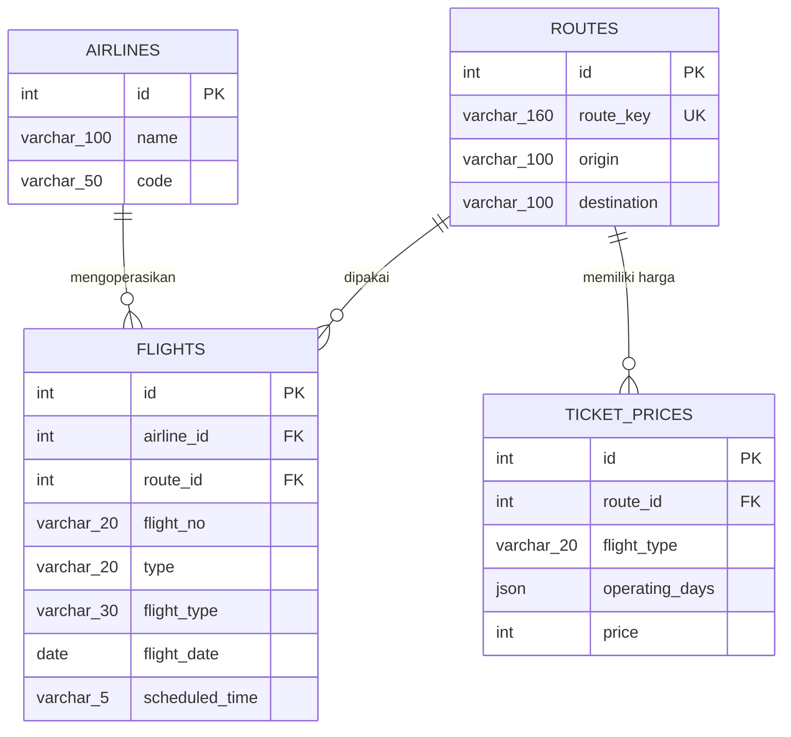

# ERD Database Bandara Tardamu

Dokumen ini merangkum struktur database proyek berdasarkan:

- `src/db/schema.ts` sebagai skema aplikasi aktif.
- Migration MySQL di `drizzle-mysql/0000_sloppy_skaar.sql`.
- Script tambahan `penginapan.sql`.
- Pemeriksaan read-only ke database yang dikonfigurasi pada `.env`.

## Ringkasan

Database utama proyek berisi modul:

- **Konten publik**: `news`
- **Penerbangan**: `flights`, `ticket_prices`, `passenger_stats`
- **Akomodasi**: `penginapan`
- **Feedback**: `feedback_submissions`
- **Autentikasi Better Auth**: `user`, `session`, `account`, `verification`

Relasi foreign key yang benar-benar didefinisikan hanya ada pada modul autentikasi:

- `session.user_id` → `user.id`
- `account.user_id` → `user.id`

Relasi lain pada modul penerbangan masih bersifat **logis/aplikatif**, belum dipaksakan oleh foreign key database.

## ERD Utama

## Relasi Logis yang Belum Menjadi Foreign Key

Relasi berikut terlihat dari struktur data dan cara aplikasi memakai tabel, tetapi belum didefinisikan sebagai constraint database.

Catatan:

- `ticket_prices.route_key` adalah representasi rute, contoh `kupang-sabu`.
- `ticket_prices` memiliki unique index gabungan pada `route_key` + `flight_type`.
- `flights.origin`, `flights.destination`, dan `flights.flight_type` dapat cocok dengan `ticket_prices`, tetapi tidak ada `ticket_price_id`.
- `passenger_stats` menyimpan agregasi statistik, bukan detail per penerbangan.

## Detail Tabel

### `news`

Menyimpan berita/pengumuman publik.

| Kolom | Tipe | Keterangan |
|---|---|---|
| `id` | int | Primary key, auto increment |
| `title` | varchar(255) | Judul berita |
| `content` | text | Isi berita |
| `image_url` | text | Gambar berita, nullable |
| `author` | varchar(100) | Default `Redaksi Bandara` |
| `slug` | varchar(255) | Unique, nullable |
| `created_at` | timestamp | Waktu dibuat |
| `updated_at` | timestamp | Waktu diperbarui |

### `flights`

Menyimpan jadwal penerbangan.

| Kolom | Tipe | Keterangan |
|---|---|---|
| `id` | int | Primary key, auto increment |
| `flight_no` | varchar(20) | Nomor penerbangan |
| `airline` | varchar(100) | Maskapai |
| `origin` | varchar(100) | Kota asal, nullable |
| `destination` | varchar(100) | Kota tujuan, nullable |
| `type` | varchar(20) | `arrival` atau `departure` |
| `flight_type` | varchar(30) | Default `reguler`; contoh lain `extra_flight`, `charter_flight`, `perintis` |
| `scheduled_time` | varchar(5) | Jadwal utama format `HH:mm` |
| `estimated_time` | varchar(5) | Perkiraan waktu, nullable |
| `status` | varchar(20) | Default `ontime` |
| `status_label` | varchar(30) | Label status tambahan |
| `notes` | text | Catatan penerbangan |
| `flight_date` | date | Tanggal penerbangan |
| `created_at` | timestamp | Waktu dibuat |
| `updated_at` | timestamp | Waktu diperbarui |

### `ticket_prices`

Menyimpan harga tiket per rute dan tipe penerbangan.

| Kolom | Tipe | Keterangan |
|---|---|---|
| `id` | int | Primary key, auto increment |
| `route_key` | varchar(160) | Kunci rute, bagian dari unique index |
| `origin` | varchar(100) | Kota asal |
| `destination` | varchar(100) | Kota tujuan |
| `flight_type` | varchar(20) | Tipe penerbangan, bagian dari unique index |
| `operating_days` | json | Daftar hari operasi |
| `price` | int | Harga tiket |
| `is_active` | boolean | Status aktif |
| `created_at` | timestamp | Waktu dibuat |
| `updated_at` | timestamp | Waktu diperbarui |

Constraint:

- Unique: `route_key` + `flight_type`

### `passenger_stats`

Menyimpan statistik penumpang.

| Kolom | Tipe | Keterangan |
|---|---|---|
| `id` | int | Primary key, auto increment |
| `date` | date | Tanggal statistik |
| `arrival_count` | int | Jumlah kedatangan |
| `departure_count` | int | Jumlah keberangkatan |
| `category` | varchar(20) | Default `domestic` |
| `airline` | varchar(100) | Maskapai, nullable |
| `flight_type` | varchar(20) | Tipe penerbangan, nullable |
| `city` | varchar(100) | Kota terkait, nullable |
| `passenger_count` | int | Jumlah penumpang |
| `load_factor` | decimal(8,2) | Load factor |
| `created_at` | timestamp | Waktu dibuat |

### `feedback_submissions`

Menyimpan masukan pengguna.

| Kolom | Tipe | Keterangan |
|---|---|---|
| `id` | int | Primary key, auto increment |
| `name` | varchar(120) | Nama pengirim |
| `message` | text | Isi feedback |
| `status` | varchar(30) | Default `new` |
| `created_at` | timestamp | Waktu dibuat |

### `penginapan`

Menyimpan data akomodasi/penginapan.

| Kolom | Tipe | Keterangan |
|---|---|---|
| `id` | int | Primary key, auto increment |
| `category` | varchar(50) | Kategori/badge |
| `name` | varchar(150) | Nama penginapan |
| `description` | text | Deskripsi, nullable |
| `photos` | json | Daftar foto |
| `facilities` | json | Daftar fasilitas |
| `price` | int | Harga |
| `phone` | varchar(30) | Nomor kontak/WA, nullable |
| `is_active` | boolean | Status aktif |
| `created_at` | timestamp | Waktu dibuat |
| `updated_at` | timestamp | Waktu diperbarui |

### `user`

Tabel pengguna dari Better Auth.

| Kolom | Tipe | Keterangan |
|---|---|---|
| `id` | varchar(255) | Primary key |
| `name` | text | Nama pengguna |
| `email` | varchar(255) | Unique |
| `email_verified` | boolean | Status verifikasi email |
| `image` | text | Foto profil, nullable |
| `created_at` | timestamp | Waktu dibuat |
| `updated_at` | timestamp | Waktu diperbarui |

### `session`

Tabel sesi login dari Better Auth.

| Kolom | Tipe | Keterangan |
|---|---|---|
| `id` | varchar(255) | Primary key |
| `expires_at` | timestamp | Waktu kedaluwarsa |
| `token` | varchar(255) | Unique |
| `created_at` | timestamp | Waktu dibuat |
| `updated_at` | timestamp | Waktu diperbarui |
| `ip_address` | text | IP pengguna, nullable |
| `user_agent` | text | User agent, nullable |
| `user_id` | varchar(255) | Foreign key ke `user.id` |

### `account`

Tabel akun/provider login dari Better Auth.

| Kolom | Tipe | Keterangan |
|---|---|---|
| `id` | varchar(255) | Primary key |
| `account_id` | varchar(255) | ID akun provider |
| `provider_id` | varchar(255) | ID provider |
| `user_id` | varchar(255) | Foreign key ke `user.id` |
| `access_token` | text | Token akses, nullable |
| `refresh_token` | text | Refresh token, nullable |
| `id_token` | text | ID token, nullable |
| `access_token_expires_at` | timestamp | Kedaluwarsa access token |
| `refresh_token_expires_at` | timestamp | Kedaluwarsa refresh token |
| `scope` | text | Scope provider |
| `password` | text | Password/hash untuk credential auth |
| `created_at` | timestamp | Waktu dibuat |
| `updated_at` | timestamp | Waktu diperbarui |

### `verification`

Tabel token/verifikasi dari Better Auth.

| Kolom | Tipe | Keterangan |
|---|---|---|
| `id` | varchar(255) | Primary key |
| `identifier` | varchar(255) | Identifier verifikasi |
| `value` | text | Nilai token/verifikasi |
| `expires_at` | timestamp | Waktu kedaluwarsa |
| `created_at` | timestamp | Waktu dibuat, nullable |
| `updated_at` | timestamp | Waktu diperbarui, nullable |

## Temuan Database Aktual

Saat dicek secara read-only, database aktual memiliki semua tabel skema aplikasi ditambah tabel `test`.

Tabel `test`:

| Kolom | Tipe | Keterangan |
|---|---|---|
| `test` | varchar(100) | Nullable |

Tabel `test` tidak muncul di `src/db/schema.ts`, migration proyek, maupun pemakaian kode aplikasi. Kemungkinan besar tabel ini adalah tabel percobaan/manual dan tidak termasuk model aplikasi utama.

Ada juga kolom tambahan generik pada database aktual:

- `flights`: `Column16` sampai `Column30`
- `passenger_stats`: `Column12` sampai `Column24`

Kolom-kolom tersebut tidak muncul di `src/db/schema.ts` dan tidak terlihat dipakai di service aplikasi. Kemungkinan berasal dari import spreadsheet/manual atau percobaan struktur. Untuk ERD aplikasi, kolom tersebut tidak dimasukkan ke model utama.

## Rekomendasi Normalisasi

Jika database ingin dibuat lebih relasional dan konsisten, pertimbangkan:

1. Buat tabel master `airlines` untuk data maskapai.
2. Buat tabel master `routes` berisi `origin`, `destination`, dan `route_key`.
3. Hubungkan `flights.route_id` ke `routes.id`.
4. Hubungkan `ticket_prices.route_id` ke `routes.id` dan pertahankan unique `route_id + flight_type`.
5. Rapikan kolom tidak terpakai di database aktual setelah backup, khususnya `Column16`–`Column30` dan `Column12`–`Column24`.
6. Hapus tabel `test` jika benar-benar tidak digunakan.

Contoh ERD target setelah normalisasi:

